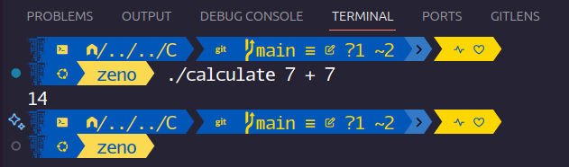

# C
This folder contains only C projects.
They are mainly progrms that can be run in the terminal.
---

## calculate.c
This is a simple calculator that can perform basic math operations:
  - **Addition**
  - **Substruction**
  - **Multiplication**
  - **Division**

--
### How to use it
- In your terminal, compile the code using the command *cc calculate.c -lcs50 -o calculate*

  - You must have the **cs50 library** installed.
  - You can use any compilor of your choice.
- Run the calculator using command *./calculate* folowed by the operation.
 
- **To perform multiplication use "\*"

---